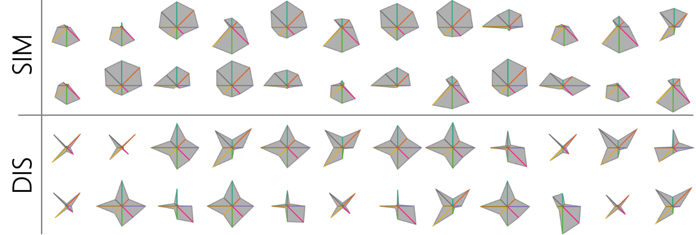

# star-glyph-study

Star Glyphs are a well-researched visualization technique to visualize multi-dimensional data, often used in small multiple settings for a visual comparison of many data points. 
However, the overall visual appearance of Star Glyphs is strongly influenced by the ordering of dimensions. 
An example is shown in the figure below, where the same set of data points are visualized by similarity and dissimilarity ordering. 
 
 

 
 
This project is a user study interface to examine how different orderings of Star Glyph influence users' visual perception in clustering tasks. The dimension orderings are pre-computed to not influence the run time during the study.
 
For the dimension ordering tool, please see: [Star Glyph Ordering](https://github.com/lydia96/star-glyph-ordering)
 
For more details about the study and restuls, please see paper: Evaluating Ordering Strategies of Star Glyph Axes
